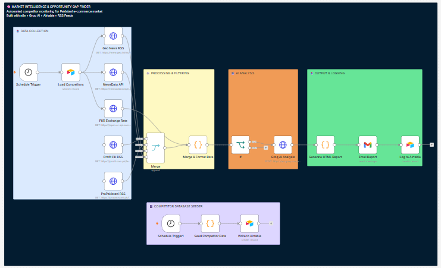

# Market Intelligence & Opportunity Gap Finder

Automated competitor monitoring system built with n8n that tracks the Pakistani 
e-commerce market, detects opportunity gaps using Groq AI, and delivers a 
formatted intelligence report via Gmail on a daily schedule.

---

## Overview



---

## What It Does

- Pulls competitor data from Airtable (Bykea, Daraz, Foodpanda, Careem, Rider)
- Fetches daily news from Geo News, ProPakistani, Profit PK, and NewsData.io
- Tracks live PKR/USD exchange rate for financial context
- Sends all data through Groq AI to identify price gaps, feature gaps, and underserved segments
- Delivers a formatted HTML email report on a daily schedule
- Logs every report to Airtable for historical tracking

---

## Tech Stack

| Tool | Role |
|------|------|
| n8n (Docker) | Automation engine |
| Groq AI | Market analysis & gap detection |
| Airtable | Competitor database & report logging |
| Gmail API | Report delivery |
| Geo News / ProPakistani / Profit PK | Pakistani news RSS feeds |
| NewsData.io | News aggregation API |
| ExchangeRate API | Live PKR market data |

---

## Setup

### 1. Run n8n via Docker
```bash
docker run -it --rm \
  --name n8n \
  -p 5678:5678 \
  -v n8n_data:/home/node/.n8n \
  n8nio/n8n
```

### 2. Import workflow
Open `localhost:5678` → Workflows → Import → upload `market-intelligence-n8n.json`

### 3. Airtable
- Create a base: `Market Intelligence`
- Create a table: `Competitor Data` with columns: Competitor, Service, Price, Delivery Speed, Unique Feature, Date Added
- Generate a Personal Access Token at `airtable.com/create/tokens` with `data.records:read` and `data.records:write` scopes

### 4. Groq API
- Get a free key at `console.groq.com`
- In the Groq AI Analysis node → Authentication → Header Auth
- Name: `Authorization` / Value: `Bearer YOUR_KEY`

### 5. Gmail OAuth
- Create a Google Cloud project and enable the Gmail API
- Create OAuth 2.0 credentials (Web application)
- Add redirect URI: `http://localhost:5678/rest/oauth2-credential/callback`
- Paste Client ID and Secret into the Gmail node in n8n
- Add your email as a test user in the OAuth consent screen

### 6. Seed competitor data
Run the Seed Competitor Data node manually once to populate Airtable.

### 7. Activate
Set your schedule in the Schedule Trigger node and toggle the workflow Active.

---

## Report Structure

Each daily email contains four sections:

- **Market Intelligence** — current market activity
- **Opportunity Gaps** — what competitors are not offering
- **Suggested Action** — specific recommendation for your business
- **Competitive Advantage** — how to position against existing players

---

## Notes

- Keep the Docker container running for scheduled triggers to fire
- NewsData.io free tier: 200 requests/day
- To stop: `docker stop n8n` — To restart: `docker start n8n`
- Never use `docker rm -v` — it deletes your saved workflows

---

*Built with n8n · Groq AI · Airtable · Docker*
